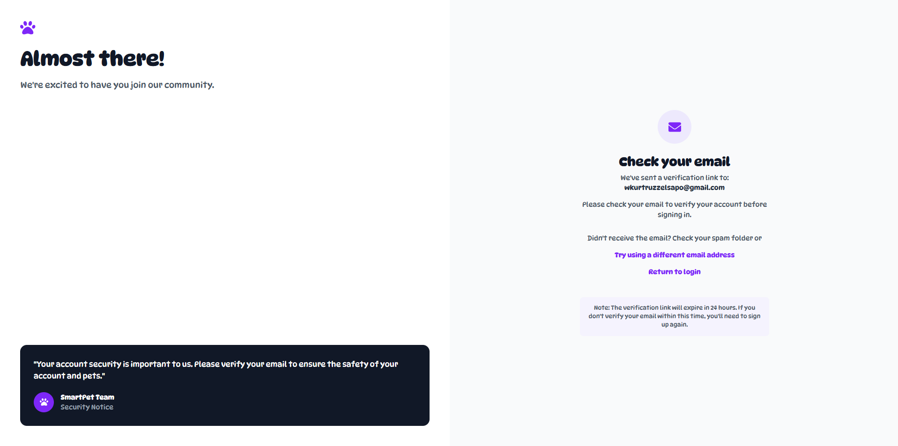
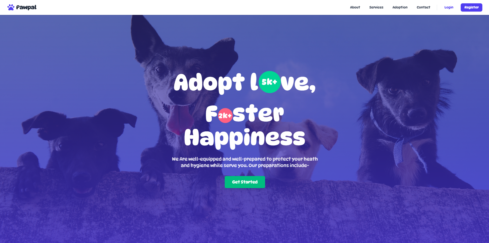
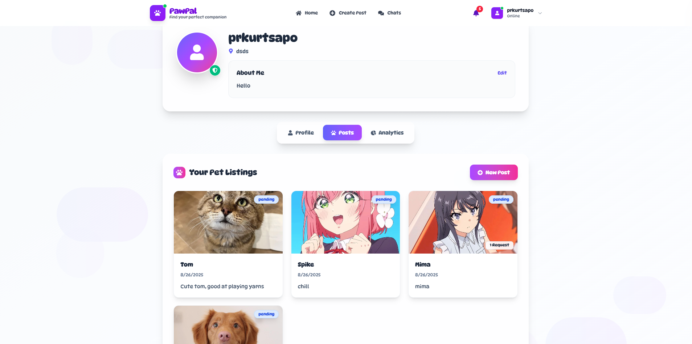
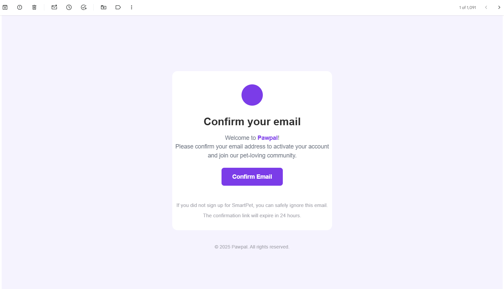

# Smart Pet – Pet Finding Application 🐾

Smart Pet is a **friendly and fun web application** built with **React**, **TypeScript**, and **Supabase** to help pet lovers **find, manage, and adopt pets** with ease.  
It’s designed to bring joy and convenience, whether you’re searching for a furry companion, chatting with other pet owners, or sharing pet adoption stories.  

## 🚀 Live Demo

👉 [Try it here!](https://pawpal-omega.vercel.app/)

---

## 🧱 Tech Stack

### Frontend
- ⚛️ React 19
- 🧠 TypeScript
- ⚡ Vite
- 🎨 Tailwind CSS
- 🔀 React Router
- 📦 React Query

### Backend (via Supabase)
- 🐘 PostgreSQL Database
- 🔐 Authentication
- 📁 File Storage
- 🔄 Real-time Subscriptions


---

## 📸 Screenshots  

Here’s a quick look at some of the **fun and useful features** of Smart Pet 👇  

### 🔑 Authentication – Secure & Simple
Sign up or log in effortlessly with email-based authentication.  
<p align="center">
  
  
</p>

---

### 🏠 Landing Page – Friendly Welcome
Our **landing page** greets you with a clean and modern design, making it easy to navigate.  
<p align="center">
  
</p>

---

### 🐾 Pet Features – Share & Adopt
Easily create posts about pets available for adoption or share updates about your furry friends.  
<p align="center">
  
  
</p>

---

### 💬 Chat System – Connect with Pet Lovers
Stay connected with other users using our **real-time chat feature**. It’s fun, fast, and mobile-friendly!  
<p align="center">
  
  
</p>

---

### 👤 Profile – Your Personal Pet Space
Manage your personal info, see your posts, and keep track of your adoption activity.  
<p align="center">
  
  
</p>

---

### 📧 Gmail Integration – Stay Updated
Receive important notifications directly through Gmail so you never miss a chance to adopt or connect.  
<p align="center">
  
</p>

---

## 🛠️ Getting Started

### 1. Clone the Repository
```bash
git clone [repository-url]
cd smart-pet
